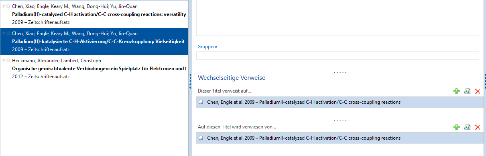

# Parallelveröffentlichung formatiert ausgeben und in das Feld "Titelzusätze" schreiben

Im Literaturverzeichnis soll bei einem Quellennachweis z.B. aus der deutschen Ausgabe einer Zeitschrift auch dessen Übersetzung in der englischen Ausgabe der Zeitschrift zitiert werden.

Um das Skript erfolgreich nutzen zu können, muss Citavi mitgeteilt werden, welche Veröffentlichungen jeweils als Parallelveröffentlichung betrachtet werden soll. Wenn Sie das gemacht haben, sorgt das Skript dafür, dass das Feld `Titelzusätze` automatisch mit den (formatierten) bibliographischen Daten der Parallelveröffentlichung gefüllt wird.

## Voraussetzungen
Citavi 5 (oder höher)

## Beispiele

- Anne Schmidt: Richtig zitieren. In: Deutschsprachige Zeitschrift 2018, 24, 7–21; Englischsprachige Zeitschrift, 2018, 36, 1–14.

## Anwendung
### Schritt 1

Fügen Sie im Zitationsstil-Editor dieses Skript bei der Komponente `Titelzusätze` ein.

Falls Sie die Komponente `Titelzusätze` auch bei Dokumententypen nutzen, bei denen keine Ausgabe der Parallelveröffentlichungen erwünscht ist, gehen Sie folgendermaßen vor: Markieren Sie die Komponente und erzeugen über den Befehl `Komponente` > `Duplizieren` eine Kopie. Alternative: Erstellen Sie über das Menü `Komponente` > `Neu` eine neue Komponente.

### Schritt 2
1. Wählen Sie den Zitationsstil in Citavi und in Citavis Word Add-In aus.
2. Blenden Sie in Citavi die Vorschau auf das Literaturverzeichnis ein: Menü `Ansicht` > `Aktuellen Titel im Zitationsstil anzeigen`.
3. Erfassen Sie den Aufsatz aus der deutschen Ausgabe der Zeitschrift.
4. Erfassen Sie den Aufsatz aus der englischen Ausgabe der Zeitschrift. 
5. Wechseln Sie bei einem der Aufsätze auf die Registerkarte `Zusammenhang`.
6. Klicken Sie unter `Wechselseitige Verweise` auf das Plus-Zeichen bei `Dieser Titel verweist auf` und wählen Sie die Übersetzung des Aufsatzes aus der Liste der erfassten Literatur aus.
7. Klicken Sie unter `Wechselseitige Verweise` auf das Plus-Zeichen bei `Auf diesen Titel wird verwiesen` und wählen Sie auch hier die Übersetzung des Aufsatzes aus der Liste der erfassten Literatur aus.

WICHTIG: Der Verweis muss in beide Richtungen erfolgen, also sowohl `Dieser Titel verweist auf` als auch `Auf diesen Titel wird verwiesen`.

## Installation
Siehe Citavi Handbuch: [Using Programmable Components](https://www.citavi.com/programmable_components)

## Autor

* **Jörg Pasch** [joepasch](https://github.com/joepasch)
